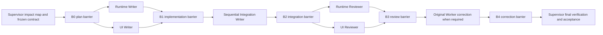

# Codex Luna Supervisor

A Codex multi-Worker orchestration skill for larger tasks: Luna handles suitable foundational implementation and routine work, while Sol remains the Supervisor responsible for decomposition, review, risk decisions, and final fallback acceptance.

[中文 README](README.md)

> [!IMPORTANT]
> This skill is **only intended for use inside the Codex desktop app**. It depends on the app's sidebar tasks, thread communication, and project context, and is not a workflow for Codex CLI, IDE extensions, ChatGPT on the web, or other agent platforms.

## Why This Skill Exists

Not every step needs Sol. Many basic implementations, documentation passes, local refactors, and routine edits can be completed by Luna. Having Sol execute every detail consumes more time and tokens without always producing a corresponding benefit.

This skill creates a clear division of responsibility inside a larger task:

- Luna performs bounded implementation, integration, correction, or read-only verification.
- Sol remains the sole Supervisor and owns impact analysis, decomposition, contract decisions, parallel dispatch, review, and final acceptance.
- Scopes, phase barriers, and bounded notifications keep lower model cost from turning into file conflicts, duplicated work, or uncontrolled polling.

This is not the default workflow for every task. Small tasks, simple edits, and work whose dispatch cost is no lower than direct execution should be handled directly. Use this skill only when a task is large enough to decompose into clear responsibilities and the value of review exceeds the coordination cost.

## How It Works

The current Codex task always remains the Supervisor. Before dispatch, it builds the complete impact map and DAG, then defines acceptance criteria, roles, dependencies, read/write scopes, shared-file ownership, frozen interfaces, verification commands, and the notification policy.

The normal execution surfaces are:

| Surface                | Purpose                                                                                      | Boundary                                                           |
| ---------------------- | -------------------------------------------------------------------------------------------- | ------------------------------------------------------------------ |
| Sidebar Luna task      | Non-trivial implementation, integration, correction, and review                              | Each Writer edits only its assigned scope                          |
| Native read-only Scout | Bounded source discovery and evidence collection                                             | No writes or recursive delegation; reports only to its parent task |
| `luna-fleet.mjs`       | Used by the in-app Supervisor for strict isolation, persistent raw events, or session resume | Internal fallback only; it is not a standalone CLI entry point     |

## Supervisor Responsibilities

Before launching Workers, the Supervisor must:

- Define the result, acceptance criteria, exclusions, and final verification.
- Map the full impact surface, including exclusive writes, shared paths, and dependency edges.
- Choose a single-writer, non-overlapping multi-writer, or isolated-worktree topology.
- Distinguish contract dependencies, write overlaps, and true execution dependencies.
- Freeze cross-Worker interfaces and assign sequential ownership of shared files.
- Record the dispatch batch, expected events, pending barrier, and terminal Workers for each phase.

Workers execute only their assigned scope. They do not redefine the user outcome or communicate directly with one another. The Supervisor relays only frozen interfaces, paths, decisions, and blockers.

## Example DAG



This is a responsibility-based example, not a template that must be filled. Omit the Integration Writer when there are no shared writes, omit independent Reviewers when risk does not justify them, and use one Writer for a sufficiently cohesive task. Workers are never created merely to increase the Worker count.

## Topology And Parallelism

| Topology           | Use when                                                        | Main constraint                                                           |
| ------------------ | --------------------------------------------------------------- | ------------------------------------------------------------------------- |
| Single writer      | One cohesive implementation scope                               | Record why decomposition would not help                                   |
| Multi-writer       | Multiple responsibilities are independently editable            | Scopes do not overlap, or each Writer uses an isolated worktree           |
| Integration Writer | Shared, generated, registry, or cross-cutting files must change | Runs sequentially after implementation and exclusively owns shared files  |
| Reviewer           | Risk justifies an independent check                             | Starts read-only after implementation is idle and integration is complete |

A Runtime/UI dependency on types, events, or snapshots does not automatically require serial work. An interface that can be frozen in advance is a contract dependency. Only inseparable write overlap or a true execution prerequisite requires sequencing.

## Phase Barriers And Notifications

Every phase has a stable `phase` and `barrier_id`. A barrier closes only after every required Worker is terminal and the Supervisor has decided every blocker and contract change.

Workers notify the Supervisor only at bounded checkpoints:

- `LUNA_PLAN`: a complex or high-risk plan needs approval.
- `LUNA_BLOCKED`: progress requires a Supervisor decision.
- `LUNA_DONE`: the Worker completed its current phase.
- `LUNA_CORRECTION_DONE`: a bounded correction is complete.

Normal waiting is callback-only: Workers wake the Supervisor by reverse-sending the `LUNA_*` events above. The Supervisor does not call blocking `wait_threads` or task-read tools for routine progress; `waiting_since` records when waiting began and `timeout_at` remains `null` by default. Only an explicitly scheduled watchdog may perform one bounded status audit; when progress is healthy, it may schedule at most one later watchdog and never chain blocking waits.

While waiting, the Supervisor does not poll Worker tasks, logs, terminals, or changing files, and does not run formatting, lint, typecheck, or builds early. Routine progress is already visible in the sidebar. After the relevant barrier closes, the Supervisor reads each participating Worker's scoped diff and evidence and then advances, requests correction, or accepts the result.

## Concurrency Budget

The default limits are:

- One Supervisor.
- At most two concurrent Writers in a shared checkout.
- No more than six active sessions, leaving one platform slot available.
- Up to two read-only Scouts per Worker and three globally.
- Reviewers start only after implementation Workers are idle and required integration is complete.

These are ceilings that control coordination cost and write conflicts, not quotas that should be filled.

## Correction And 429 Handling

When review finds a blocking issue, send the correction to the original Worker. Preserve its context and write scope, and provide only the concrete finding, affected paths, frozen decision, and checks that must be rerun.

If Luna explicitly reports `429 Too Many Requests`, send `继续` to the same Worker lineage. Do not create a replacement Worker, resend the full assignment, or enter a status-poll loop.

## Requirements

- The Codex desktop app; this skill is not supported as a standalone Codex CLI or other-client workflow.
- Codex with access to `gpt-5.6-luna`.
- Codex Desktop thread tools for sidebar-visible Workers.
- Node.js and a working `codex` executable only when the in-app Supervisor invokes the internal fallback.

The skill checks the actual execution surface before dispatch. If the sidebar thread tools or Luna model are unavailable, it reports the capability blocker instead of pretending dispatch succeeded or silently substituting another model.

## Install

Install from GitHub with the built-in skill installer:

```bash
python3 "${CODEX_HOME:-$HOME/.codex}/skills/.system/skill-installer/scripts/install-skill-from-github.py" \
  --repo dingding12322/codex-luna-supervisor \
  --path skills/luna-supervisor-orchestrator
```

The skill becomes available on the next Codex task.

## Use

Invoke it explicitly when a larger task is suitable for delegated Luna implementation or review:

```text
$luna-supervisor-orchestrator use Luna to implement the requested change.
```

The complete agent-facing protocol lives in [`skills/luna-supervisor-orchestrator/SKILL.md`](skills/luna-supervisor-orchestrator/SKILL.md). The Skill README explains the state machine and execution gates; `SKILL.md` is the authoritative operating contract that Codex follows, and `scripts/luna-guard.mjs` provides executable ledger, envelope, and review validation.

## Repository Layout

```text
codex-luna-supervisor/
├── README.md
├── README.en.md
└── skills/luna-supervisor-orchestrator/
    ├── SKILL.md
    ├── README.md
    ├── agents/openai.yaml
    └── scripts/
        ├── luna-fleet.mjs
        └── luna-guard.mjs
```

`scripts/luna-fleet.mjs` is only invoked by a Supervisor running inside the Codex app when strict isolation, persistent raw events, or session resume is required. It is not a standalone CLI product surface. `scripts/luna-guard.mjs` validates ledger, event envelope, and review evidence before state transitions. Sidebar-visible Codex tasks are always the default execution surface.
