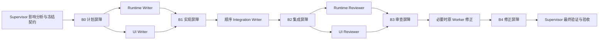

# Codex Luna Supervisor

面向较大任务的 Codex 多 Worker 编排 skill：让 Luna 承担适合它的基础实现和常规工作，让 Sol 留在 Supervisor 位置负责拆解、审查、风险判断和最终兜底。

[English README](README.en.md)

> [!IMPORTANT]
> 本 skill **仅限在 Codex 桌面应用内使用**。它依赖 Codex app 提供的侧栏 task、thread 通信和项目上下文能力，不面向 Codex CLI、IDE 扩展、ChatGPT 网页端或其他 Agent 平台。

## 为什么创建这个 skill

并不是每一步工作都需要 Sol。很多基础实现、资料整理、局部重构和常规修改完全可以由 Luna 完成。让 Sol 亲自处理所有细节，会占用更多执行时间和 token，却未必带来相应收益。

这个 skill 的目标是在一个较大任务内部建立清晰分工：

- Luna 负责边界明确、可以独立完成的实现、集成、修正或只读核验。
- Sol 作为唯一 Supervisor，负责理解完整影响范围、拆分任务、冻结契约、安排并行、审查结果和最终验收。
- 通过作用域、阶段屏障和有限通知约束协作，避免节省模型成本的同时引入文件冲突、重复工作或失控轮询。

这不是所有任务的默认流程。小任务、简单修改和派发成本不低于直接完成的工作，应该由当前 Agent 直接处理。只有任务足够大、能够拆成明确责任范围，并且审查收益高于协调成本时，才适合使用本 skill。

## 工作方式

当前 Codex task 始终是 Supervisor，不会把最终责任交给 Worker。Supervisor 在派发前建立完整影响图和 DAG，明确验收标准、角色、依赖、读写范围、共享文件所有权、冻结接口、验证命令和通知策略。

默认执行面如下：

| 执行面 | 用途 | 边界 |
| --- | --- | --- |
| 侧栏 Luna task | 非平凡实现、集成、修正和审查 | 每个 Writer 只写自己的明确范围 |
| 原生只读 Scout | 有界的源码定位和证据收集 | 不写文件、不递归委派，只向父任务返回证据 |
| `luna-fleet.mjs` | 应用内 Supervisor 需要严格隔离、持久化原始事件或恢复会话时使用 | 仅作为内部 fallback，不是独立 CLI 使用入口 |

## Supervisor 负责什么

派发前，Supervisor 必须完成：

- 定义结果、验收条件、排除项和最终验证。
- 建立完整影响范围，识别独占写入、共享路径和依赖边。
- 选择 single-writer、非重叠 multi-writer 或隔离 worktree 拓扑。
- 区分契约依赖、写入重叠和真正的执行顺序依赖。
- 冻结跨 Worker 接口，并确定共享文件由谁顺序集成。
- 为每个阶段记录派发批次、预期事件、待关闭屏障和终态 Worker。

Worker 只负责被分配的范围，不重新定义用户目标，也不相互直接通信。跨 Worker 的接口、路径、决策和 blocker 由 Supervisor 统一转发。

## 示例 DAG



这只是按职责拆分的示例，不是必须填满的模板。没有共享写入时跳过 Integration Writer；风险不足时跳过独立 Reviewer；任务足够内聚时使用一个 Writer。不会为了增加 Worker 数量而制造无意义节点。

## 拓扑与并行

| 拓扑 | 适用情况 | 主要约束 |
| --- | --- | --- |
| Single writer | 一个内聚的实现范围 | 必须记录为什么不需要拆分 |
| Multi-writer | 多个责任范围可独立编辑 | 写范围不重叠，或使用隔离 worktree |
| Integration Writer | 共享、生成、注册或横切文件需要修改 | 在实现阶段后顺序执行，独占共享文件 |
| Reviewer | 风险值得增加独立核验 | 实现 Worker 空闲且集成完成后再启动，只读 |

Runtime 和 UI 之间存在类型、事件或快照依赖，并不自动意味着必须串行。能够提前冻结的接口属于契约依赖；只有无法分离的写入重叠或真正的执行前置条件才要求顺序执行。

## 阶段屏障与通知

每个阶段都有稳定的 `phase` 和 `barrier_id`。只有必需 Worker 都进入终态，且 blocker 和契约变更已由 Supervisor 决策，屏障才关闭。

Worker 只在以下检查点通知 Supervisor：

- `LUNA_PLAN`：复杂或高风险任务需要批准计划。
- `LUNA_BLOCKED`：需要 Supervisor 决策才能继续。
- `LUNA_DONE`：Worker 已完成当前阶段。
- `LUNA_CORRECTION_DONE`：定点修正已经完成。

等待期间不轮询 Worker task、日志、终端或变化中的文件，也不提前运行格式化、lint、typecheck 或 build。常规进度已经在侧栏可见，不需要重复转发。Supervisor 在相关屏障关闭后读取每个参与 Worker 的 scoped diff 和证据，再决定推进、修正或验收。

## 并发预算

默认预算为：

- 一个 Supervisor。
- 共享 checkout 中最多两个并发 Writer。
- 总 active session 不超过六个，为平台保留一个槽位。
- 每个 Worker 最多两个只读 Scout，全局最多三个。
- Reviewer 只在实现 Worker 空闲且必要集成完成后启动。

这些是控制协调成本和写入冲突的上限，不是必须用满的配额。

## 修正与 429

审查发现阻塞问题时，修正任务发送给原 Worker，保留它的上下文和写入范围，只提供明确问题、受影响路径、冻结决策和需要重跑的检查。

如果 Luna 明确返回 `429 Too Many Requests`，向同一 Worker lineage 发送 `继续`。不要创建替代 Worker、重复发送完整任务或进入频繁状态轮询。

## 环境要求

- Codex 桌面应用；不支持将本 skill 作为 Codex CLI 或其他客户端的独立工作流使用。
- 可访问 `gpt-5.6-luna` 的 Codex。
- 支持侧栏可见 Worker 的 Codex Desktop thread tools。
- 只有应用内 Supervisor 调用内部 fallback 时，才需要 Node.js 和可用的 `codex` 可执行文件。

该 skill 会在派发前检查实际可用的执行面。如果侧栏 thread tools 或 Luna 模型不可用，它会报告能力 blocker，而不是假装完成派发或静默替换模型。

## 安装

使用 Codex 内置的 skill installer 从 GitHub 安装：

```bash
python3 "${CODEX_HOME:-$HOME/.codex}/skills/.system/skill-installer/scripts/install-skill-from-github.py" \
  --repo dingding12322/codex-luna-supervisor \
  --path skills/luna-supervisor-orchestrator
```

安装完成后，skill 会在下一次 Codex task 中生效。

## 使用

当一个较大任务适合委派 Luna 实现或审查时，显式调用：

```text
$luna-supervisor-orchestrator use Luna to implement the requested change.
```

完整的 Agent 执行协议位于 [`skills/luna-supervisor-orchestrator/SKILL.md`](skills/luna-supervisor-orchestrator/SKILL.md)。README 解释设计和工作流，`SKILL.md` 是 Codex 实际遵循的权威规则。

## 仓库结构

```text
codex-luna-supervisor/
├── README.md
├── README.en.md
└── skills/luna-supervisor-orchestrator/
    ├── SKILL.md
    ├── agents/openai.yaml
    └── scripts/luna-fleet.mjs
```

`scripts/luna-fleet.mjs` 只供 Codex app 内的 Supervisor 在严格隔离、持久化原始事件或恢复会话时调用，不构成独立的 CLI 产品入口。侧栏可见的 Codex task 始终是默认执行方式。
