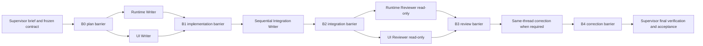

# Luna Supervisor Orchestrator

This skill turns delegated Luna work into a small, observable DAG. The current Codex task remains the Supervisor: it defines the result, freezes contracts, owns phase barriers, reviews evidence, and decides whether the task is accepted.

Read SKILL.md for the agent-facing operating rules. This README is a human-facing map of the workflow and its surfaces.

## Purpose And Surfaces

Use sidebar-visible gpt-5.6-luna tasks for non-trivial implementation, integration, correction, and review. Use native V2 read-only scouts only when a bounded source-discovery pass will reduce worker context pressure. Use scripts/luna-fleet.mjs only as the CLI fallback for strict isolation, persistent raw events, or CLI session resume.

The CLI fallback keeps its existing filename and stores historical runs at ~/.codex/luna-fleet-runs/. It is not a replacement for Supervisor-owned planning and review.

## Supervisor Responsibilities

Before launch, the Supervisor records:

- The result and acceptance criteria.
- Worker roles, phases, dependencies, barrier IDs, and final checks.
- Read scopes, write scopes, exclusions, and shared-file ownership.
- Frozen runtime/UI interfaces and decisions that cross worker boundaries.
- The notification policy and the point at which each worker task will be read.

In multi-worker mode, the Supervisor owns the main task.md or task ledger. Workers may read it but do not edit it. Workers never message one another; the Supervisor relays only frozen interfaces, decisions, paths, and blockers.

## Supervisor State Machine

Before launch, the Supervisor prepares dispatch_batch, expected_events, pending_barrier, and terminal_workers in the ledger or task.md. A successful implementation/review dispatch or correction send initializes waiting_since=now and enters callback-only WAITING_FOR_EVENT; timeout_at stays null unless an optional watchdog is explicitly scheduled.

```mermaid
stateDiagram-v2
  [*] --> PLANNING
  PLANNING --> WAITING_FOR_EVENT: successful dispatch; callback-only
  WAITING_FOR_EVENT --> REVIEWING_BARRIER: LUNA_PLAN or LUNA_BLOCKED decision
  REVIEWING_BARRIER --> WAITING_FOR_EVENT: successful approval/resolution; callback-only
  WAITING_FOR_EVENT --> WAITING_FOR_EVENT: LUNA_DONE with required nodes non-terminal; barrier open; callback-only
  WAITING_FOR_EVENT --> REVIEWING_BARRIER: LUNA_DONE that closes its barrier; no reset
  WAITING_FOR_EVENT --> REVIEWING_BARRIER: LUNA_CORRECTION_DONE
  WAITING_FOR_EVENT --> PLANNING: new user instruction
  WAITING_FOR_EVENT --> WAITING_FOR_EVENT: scheduled watchdog; timeout_at after waiting_since
  WAITING_FOR_EVENT --> REVIEWING_BARRIER: stalled or failed timeout audit
  REVIEWING_BARRIER --> CORRECTING: bounded fix required
  CORRECTING --> WAITING_FOR_EVENT: successful correction send; callback-only
  REVIEWING_BARRIER --> ACCEPTING: final barrier and planned checks
```

While waiting, Worker reverse-send delivery is the normal wake and sidebar routine progress needs no Supervisor relay. Reset waiting_since only after successful event handling and immediately before returning to callback-only WAITING_FOR_EVENT. A reverse-send failure permits one bounded read only after a user instruction or scheduled watchdog wake. If an instruction must be sent, the send must succeed first.

Normal WAITING_FOR_EVENT makes no blocking wait or task-read call. Consume only reverse `LUNA\_\*` notifications; an optional watchdog may wake one bounded audit and then either intervene or schedule one later watchdog.

| Allowed while waiting                                                                                                                                                | Forbidden while waiting                                                    |
| -------------------------------------------------------------------------------------------------------------------------------------------------------------------- | -------------------------------------------------------------------------- |
| Receive a `LUNA_DONE` while required nodes remain non-terminal and the barrier remains open; update its envelope/barrier state, then return to callback-only waiting | Poll Worker tasks, status, logs, terminals, or raw events                  |
| For approval-required `LUNA_PLAN` or evidence-required `LUNA_BLOCKED`, read only the notifying Worker task once after a user instruction or watchdog wake            | Read any other Worker task outside the applicable closed-barrier read      |
| At a scheduled watchdog wake, perform exactly one bounded status/task audit; schedule at most one later watchdog if progress is healthy                              | Read changing Worker files, scoped diffs, reports, or raw events           |
| Decide the event and return to waiting; handle a new user instruction in `PLANNING`                                                                                  | Reopen decomposition, frozen decisions, or foundational reading            |
|                                                                                                                                                                      | Run early formatting, lint, typecheck, build, validation, or forward tests |
|                                                                                                                                                                      | Launch overlapping workers or send status requests                         |

Allowed wake conditions are Worker reverse-send delivery of `LUNA_PLAN`, `LUNA_BLOCKED`, `LUNA_DONE`, or `LUNA_CORRECTION_DONE`, a new user instruction, or an explicitly scheduled watchdog. A `LUNA_DONE` that closes its barrier or a closed barrier returns to `REVIEWING_BARRIER`/`ACCEPTING` without resetting a waiting deadline; a `LUNA_DONE` received while required nodes remain non-terminal and the barrier remains open returns to callback-only waiting. A decision-required `LUNA_PLAN`, or a `LUNA_BLOCKED` event needing full evidence, permits exactly one bounded read of only the notifying Worker task after a user instruction or watchdog wake; after successful approval/resolution instruction, return to callback-only waiting. A watchdog permits exactly one bounded audit and then either intervention or one later watchdog. New user instructions return to `PLANNING`; correction completion returns to `REVIEWING_BARRIER`. Routine progress, speculation, file reads, status requests, and polling never count as checkpoints and never reset the window.

## Executable Guard

The Supervisor ledger carries one structured JSON object between these markers:

```text
<!-- luna-guard:start -->

{
  "schema_version": 1,
  "state": "PLANNING",
  "ready_nodes": ["runtime-writer"],
  "dispatch_batch": ["runtime-writer"],
  "expected_events": ["LUNA_DONE"],
  "pending_barrier": "B1",
  "terminal_workers": [],
  "waiting_since": null,
  "timeout_at": null
}

<!-- luna-guard:end -->
```

Run the dependency-free guard from any checkout:

```bash
node ~/.codex/skills/luna-supervisor-orchestrator/scripts/luna-guard.mjs ledger <task.md>
node ~/.codex/skills/luna-supervisor-orchestrator/scripts/luna-guard.mjs envelope '<json>' --supervisor-thread-id <supervisor-thread-id>
node ~/.codex/skills/luna-supervisor-orchestrator/scripts/luna-guard.mjs read-gate '<json>' --ledger <task.md> --supervisor-thread-id <supervisor-thread-id>
node ~/.codex/skills/luna-supervisor-orchestrator/scripts/luna-guard.mjs review '<json>' --ledger <task.md>
```

The ledger command reads exactly one marker block. `PLANNING` and `CORRECTING` require non-empty `ready_nodes`, `dispatch_batch`, and `expected_events`, equal unique `ready_nodes`/`dispatch_batch` sets, null wait timestamps, and empty pre-send `launch_results` when that field is present. `WAITING_FOR_EVENT` requires non-empty `dispatch_batch`/`expected_events`, exact launch-result keys matching `dispatch_batch`, and values exactly `"launched"` or `"instructed"`, plus non-null ISO `waiting_since`; `timeout_at` may be null for callback-only waiting and, when present, must be later. `REVIEWING_BARRIER` requires non-empty `dispatch_batch`/`expected_events`, `barrier_closed_at`, and terminal coverage; `ACCEPTING` keeps the common ledger checks without requiring unrelated fields.

The envelope command requires the Supervisor notification-target UUID, rejects unknown or missing keys, placeholder Worker IDs, Supervisor/Worker ID equality, inconsistent decision and contract-change fields, and changed-path count mismatches. `--source-thread-id` remains a compatibility alias, but new commands use the semantic `--supervisor-thread-id` name. An invalid envelope is a non-event and never closes a barrier. Allow one envelope-only resend from the same Worker using the Guard's repair guidance; do not relaunch or re-dispatch for that recovery.

The read-gate command checks the accepted envelope against the authoritative ledger. Run it against the matching `WAITING_FOR_EVENT` ledger before entering `LUNA_PLAN`/`LUNA_BLOCKED` decision handling; it permits a completion read only after the matching barrier closes in `REVIEWING_BARRIER`. Event validation by itself does not authorize a task read.

Before reviewer dispatch, record `review_target_barrier_id`, `barrier_closed_at`, `scope_revision`, and `review_changed_paths={count,paths}` in the current Supervisor ledger. The review command requires `--ledger <task.md>` and compares the submitted target/current barrier, closure timestamp, scope revisions, and changed paths exactly against those authoritative fields. A standalone review command fails with usage guidance. It also requires a current reviewer UUID, valid timestamps, and `review_started_at` strictly after `barrier_closed_at`; a reviewer from an earlier barrier or earlier user turn cannot satisfy the current review phase. If freshness fails, refresh the ledger metadata and reviewer evidence rather than accepting stale output.

## Topology Selection

Choose one writer unless the work has a real independent split.

| Topology      | Use when                                                  | Constraints                                                                                                        |
| ------------- | --------------------------------------------------------- | ------------------------------------------------------------------------------------------------------------------ |
| Single writer | One cohesive implementation scope                         | Approve zero to two read-only scouts inside the worker                                                             |
| Multi-writer  | Runtime and UI or other scopes are independently editable | Scopes cannot overlap, or writers use isolated worktrees                                                           |
| Integration   | Shared or cross-cutting files must change                 | When applicable, one sequential Integration Writer owns those files                                                |
| Review        | Risk justifies an independent check                       | When used, Supervisor-owned read-only reviewers start after applicable integration and idle implementation workers |

Runtime and UI writers can run together only after their interface contract is frozen. Do not let implementation workers create nested writers, reviewers, or Fleet runs.

## Example DAG



This is a proportional example, not a required template. Omit the Integration Writer when there are no shared or cross-cutting writes, omit independent reviewer branches when risk does not justify them, and never create a worker merely to fill the diagram. When reviewers are used, keep them after any applicable integration phase and after implementation workers are idle.

For a single-writer task, replace the Runtime/UI branch with one implementation node and keep only the integration, review, correction, and acceptance barriers that reduce uncertainty.

## Concurrency Budget

The default budget is one Supervisor, at most two concurrent writers in a shared checkout, and no more than six active sessions total so one platform slot remains available. When used, reviewers start only after implementation workers are idle and any applicable integration is complete. A worker may have zero to two approved internal scouts; no more than three internal scouts may be active globally.

Each scout has a stable name, a non-overlapping read scope, explicit questions and exclusions, and a required evidence format. Scouts run once with fork_turns: none in read-only mode, do not write or delegate, and must all finish before their parent worker edits.

## Ownership Matrix

| Surface                                        | Owner                      | May write                                               | May communicate                     |
| ---------------------------------------------- | -------------------------- | ------------------------------------------------------- | ----------------------------------- |
| Result, DAG, barriers, task.md, final decision | Supervisor                 | Coordination files and ledger metadata only after dispatch | All workers, at bounded checkpoints |
| Runtime/UI implementation                      | Assigned writer            | Its own non-overlapping scope                           | Supervisor only                     |
| Shared/cross-cutting files                     | Integration Writer         | Shared scope, sequentially                              | Supervisor only                     |
| Runtime/UI review                              | Supervisor-owned reviewer  | Nothing                                                 | Supervisor only                     |
| Source discovery                               | Approved scout             | Nothing                                                 | Parent worker only                  |
| CLI artifacts                                  | CLI fallback worker/script | Its authorized scope and run artifacts                  | Supervisor via bounded reports      |

## Barrier Behavior

Each phase gets a stable ID and barrier_id. A barrier closes only when its required workers are terminal and blockers or contract changes have an explicit Supervisor decision. After closure, the Supervisor reads each participating worker task at most once for that applicable checkpoint or barrier, reviews its scoped diff and evidence, and advances or sends a correction. This is not a one-read limit for the Worker's lifetime.

`LUNA_DONE` is recorded but does not trigger an early deep read. `LUNA_PLAN` is reserved for approval and may authorize one bounded read of its notifying Worker task when evidence is needed; `LUNA_BLOCKED` requires an immediate decision and has the same narrow read exception when full evidence is needed. Do not read other Worker tasks before closure. `LUNA_CORRECTION_DONE` is processed at the correction barrier. Routine progress and logs are not notifications.

Every event carries phase, barrier_id, decision_required, and contract_changes in addition to the worker identity, assignment, changed paths, validation summary, and scoped-review request:

```json
{
  "event": "LUNA_BLOCKED",
  "worker_thread_id": null,
  "assignment_or_status": "UI Writer blocked on contract",
  "phase": "P1",
  "barrier_id": "B1",
  "decision_required": true,
  "contract_changes": ["ui-state now receives a stable itemId"],
  "changed_paths": { "count": 0, "paths": [] },
  "validation_summary": "No edits made",
  "request": "Supervisor: decide the contract change and review this scoped task."
}
```

When the Worker UUID is unknown, use `null`; the Supervisor resolves sender identity from message metadata and the dispatch ledger.

## Correction And 429 Flow

Send corrections to the same worker thread and keep its original scope and session lineage. State only the blocking finding, affected paths, contract decision, and required checks. The Supervisor never edits Worker-owned product source or documentation after dispatch, including trivial or one-line fixes. If the original lineage cannot continue after its defined recovery path, return to PLANNING and explicitly reassign ownership before replacement edits. Review the result at the correction barrier.

For a visible or reported 429 Too Many Requests, resume the original same-thread/same-session worker immediately with the exact message 继续. Do not poll status or logs, create a replacement, resend the full assignment, or switch to another surface. The CLI equivalent is luna-fleet.mjs resume against the original run and worker with the original effort.

## CLI Fallback

```bash
node ~/.codex/skills/luna-supervisor-orchestrator/scripts/luna-fleet.mjs start \
  --cwd "$PWD" \
  --task "Perform the bounded assignment." \
  --scopes "src/module" \
  --mode workspace-write \
  --effort max
```

Keep ~/.codex/luna-fleet-runs/ and the script filename unchanged. CLI workers still prohibit nested subagents. Inspect reports and authorized diffs at phase barriers; do not turn raw event files into routine progress messages.

## Launch Checklist

- [ ] State result, acceptance, exclusions, verification, and final decision owner.
- [ ] Choose single-writer, non-overlapping multi-writer, or isolated-worktree topology.
- [ ] Assign only the phases and nodes that reduce uncertainty; skip unnecessary integration/review nodes and never create a worker to fill the template.
- [ ] Freeze runtime/UI interfaces before concurrent writers start.
- [ ] Approve zero to two scouts per worker and no more than three globally, or state internal scouts: none.
- [ ] State the concurrency budget and notification policy.
- [ ] Prepare dispatch_batch, expected_events, pending_barrier, and terminal_workers before launch; set waiting_since after a successful dispatch or correction send and leave timeout_at null unless a watchdog is scheduled.
- [ ] Require non-empty active batches; keep pre-send `launch_results` empty and require exact dispatch keys with `launched`/`instructed` values while waiting.
- [ ] Launch sidebar workers with explicit scopes, effort, phase, barrier, and contract.
- [ ] While waiting, consume Worker reverse-send notifications only; a scheduled watchdog permits one bounded audit and at most one later watchdog timestamp.
- [ ] Allow only the notifying-task read for a required PLAN/BLOCKED decision after a user instruction or watchdog wake; a scheduled watchdog permits one bounded audit, then either intervene or schedule one later watchdog.
- [ ] Run `read-gate` before every permitted Worker-task read; event validation alone is not read authorization.
- [ ] Read worker tasks at most once per applicable checkpoint/barrier: after closure except for the narrow decision exception.
- [ ] Integrate shared files sequentially when applicable, then start read-only reviewers only when risk justifies them.
- [ ] Before reviewer dispatch, record authoritative review barrier, closure timestamp, scope revision, and changed paths in the Supervisor ledger; run `review '<json>' --ledger <task.md>` for acceptance.
- [ ] Verify the scoped diff and make the final Supervisor acceptance decision.
